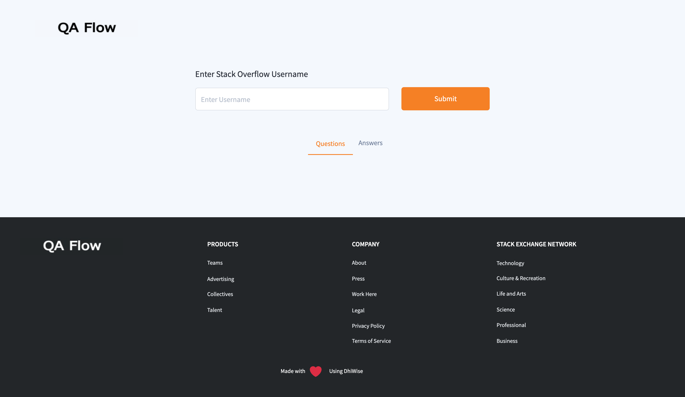
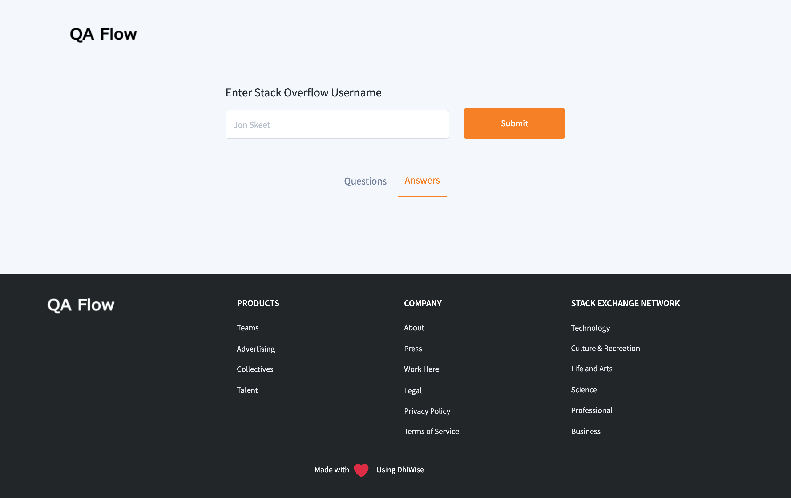
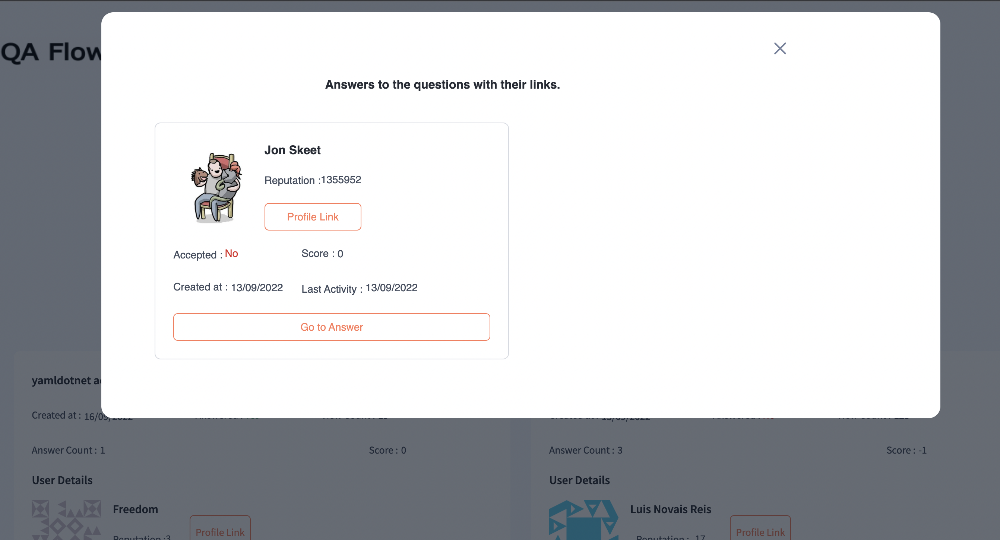

# QA Flow

QA Flow is a platform where users can find Questions and answers posted by any users in one go. The only need for this platform to search any individual from Stack Overflow is a username. DhiWise and Stack Exchange's open APIs are used to build QA Flow.

## Table of Contents

- [Features provided in QA Flow](#features-provided-in-qa-flow)
- [Setup](#setup)
- [Version of Technologies](#version-of-technologies)
- [Folder Structure](#folder-structure)
- [Dependencies in project](#dependencies-in-the-project)
- [License](#license)
- [Community](#community)

# Features provided in QA Flow

QA Flow consists of two pages. The first is for questions, while the second is for answers.

To search for all questions posted by any individual on Stack Overflow, enter the individual's username on the Questions page and click the Submit button.



To access the Answer posted by a specific user, enter the username on the Answers page.



When you click the "Show Answer" button, a popup window will appear with the answer to any specific question.



# Setup

Setup your project by running the following commands.

```sh
npm install
```

To run the application in the project directory, you can run:

```sh
npm start
```

Runs the app in the development mode.<br>
Open [http://localhost:3000](http://localhost:3000) to view it in the browser.

The page will reload if you make edits.<br>
You will also see any lint errors in the console.

## Clone Project

To clone a project firstly choose the directory to clone the project. Then open the terminal at the location and run the below commands.

    git clone https://github.com/DhiWise/QA-Flow

## Running the storybook

We have detected common components and have generated possible variants of it. To check the documentation of generated common components by integrating storybook, Please follow below steps.

## Install and Initializes

     npx storybook init

## Run the Storybook

      npm run storybook

## Version of Technologies

- [git](https://git-scm.com/) - v2.13 or greater
- [NodeJS](https://nodejs.org/en/) - `12 || 14 `
- [npm](https://www.npmjs.com/) - v6 or greater

## Folder Structure

After creation, your project should look like this:

```
.
├── package.json
├── package-lock.json
├── postcss.config.js
├── public
│   ├── favicon.ico
│   ├── index.html
│   ├── logo192.png
│   ├── logo512.png
│   ├── manifest.json
│   └── robots.txt
├── README.md
├── src
│   ├── App.js
│   ├── assets
│   │   ├── fonts ---------- Project fonts
│   │   └── images --------- All Project Images
│   ├── components --------- UI and Detected Common Components
│   ├── constants ---------- Project constants, eg: string consts
│   ├── hooks -------------- Helpful Hooks
│   ├── index.js
│   ├── pages -------------- All route pages
│   ├── Routes.js ---------- Routing
│   ├── styles
│   │   ├── index.css ------ Other Global Styles
│   │   └── tailwind.css --- Default Tailwind modules
│   └── util
│       └── index.js ------- Helpful utils
└── tailwind.config.js ----- Entire theme config, colors, fonts etc.
```

For the project to build, **these files must exist with exact filenames**:

- `public/index.html` is the page template;
- `src/index.js` is the JavaScript entry point.

# Dependencies in the project

Below are all the dependencies that were used in the project.

1. @tailwindcss/forms - `0.4.0`
2. @testing-library/jest-dom - `^5.15.1`
3. @testing-library/react - `^11.2.7`
4. @testing-library/user-event - `^12.8.3`
5. axios - `^0.27.2`
6. lodash - `^4.17.21`
7. moment - `^2.29.4`
8. prop-types - `^15.8.1`
9. react - `17.0.2`
10. react-datepicker - `^4.5.0`
11. react-dom - `17.0.2`
12. react-modal - `^3.14.4`
13. react-router-dom - `6.0.2`
14. react-router-hash-link - `^2.4.3`
15. react-scripts - `5.0.0`
16. react-toastify - `^9.0.1`
17. web-vitals - `^2.1.0`
18. yup - `^0.32.11`

# License

MIT License

Copyright (c) 2022 DhiWise

Permission is hereby granted, free of charge, to any person obtaining a copy
of this software and associated documentation files (the "Software"), to deal
in the Software without restriction, including without limitation the rights
to use, copy, modify, merge, publish, distribute, sublicense, and/or sell
copies of the Software, and to permit persons to whom the Software is
furnished to do so, subject to the following conditions:

The above copyright notice and this permission notice shall be included in all
copies or substantial portions of the Software.

THE SOFTWARE IS PROVIDED "AS IS", WITHOUT WARRANTY OF ANY KIND, EXPRESS OR
IMPLIED, INCLUDING BUT NOT LIMITED TO THE WARRANTIES OF MERCHANTABILITY,
FITNESS FOR A PARTICULAR PURPOSE AND NON-INFRINGEMENT. IN NO EVENT SHALL THE
AUTHORS OR COPYRIGHT HOLDERS BE LIABLE FOR ANY CLAIM, DAMAGES, OR OTHER
LIABILITY, WHETHER IN AN ACTION OF CONTRACT, TORT, OR OTHERWISE, ARISING FROM,
OUT OF OR IN CONNECTION WITH THE SOFTWARE OR THE USE OR OTHER DEALINGS IN THE
SOFTWARE.

## Community

<a href="https://twitter.com/dhiwise"></a>
<a href="https://www.youtube.com/c/DhiWise"></a>
<a href="https://discord.com/invite/rFMnCG5MZ7"></a>
<a href="https://docs.dhiwise.com/"></a>
